# Djangalytics Architecture

This document outlines the architecture, data flow, and technical design decisions for the Djangalytics event analytics platform with integrated demo games and project-based authentication.

## System Overview

Djangalytics is a full-stack web application that captures, stores, and visualizes event data in real-time. It follows a modern web architecture with a REST API backend, reactive frontend, and includes live demo games that showcase real-world analytics integration.


## Component Architecture

### Backend Architecture (Django)


### Frontend Architecture (React)


## Data Flow

### Event Capture Flow


### Dashboard Data Flow


## Database Schema

### Database Schema


**Project Table Structure:**
- `id`: Primary key (auto-increment)
- `name`: Human-readable project name
- `slug`: URL-friendly identifier (unique)
- `api_key`: Public API key for authentication (pk_...)
- `secret_key`: Secret key for server-side use (sk_...)
- `allowed_sources`: JSON array of allowed source names
- `rate_limit_per_minute`: Max events per minute (default: 1000)

**Event Table Structure:**
- `id`: Primary key (auto-increment)
- `project_id`: Foreign key to Project (required)
- `event_name`: String field (max 100 chars) - the type of event
- `source`: Source application (e.g., "snake-game", "flappy-hedgehog")
- `timestamp`: DateTime field with auto-generated timestamp
- `properties`: JSON field for additional event metadata
- `user_agent`: Browser/client information
- `ip_address`: Client IP for analytics/security

**ProjectRateLimit Table Structure:**
- `id`: Primary key (auto-increment)
- `project_id`: Foreign key to Project
- `minute_bucket`: Datetime rounded to minute (for rate limiting)
- `request_count`: Number of requests in that minute

## API Design

### REST Endpoints


#### POST /api/capture_event/
**Purpose**: Create new event records
**Authentication**: None (open endpoint)
**Rate Limiting**: None (development)

**Request Schema**:
```json
{
  "event_name": "string (required)",
  "timestamp": "ISO datetime (optional)",
  "properties": "object (optional)"
}
```

#### GET /api/stats/
**Purpose**: Retrieve aggregated analytics data
**Caching**: None (real-time data)

**Response Schema**:
```json
{
  "daily_stats": [{"date": "date", "event_name": "string", "count": "int"}],
  "event_counts": [{"event_name": "string", "count": "int"}],
  "recent_events": [{"id": "int", "event_name": "string", "timestamp": "datetime"}],
  "total_events": "int"
}
```

## Technology Stack

### Backend Dependencies


### Frontend Dependencies


## Deployment Architecture

### Development Environment


### Production Considerations


## Security Considerations

### CORS Configuration
- **Allow All Origins**: Following industry standard for analytics services
- Similar approach to Google Analytics, Mixpanel, Segment
- Security handled via project API key authentication instead of origin restrictions

### API Security
- **Project-based Authentication**: API keys required for event capture
- **Rate Limiting**: Per-project rate limits prevent abuse
- **Source Validation**: Projects can restrict allowed source applications
- **Input Validation**: Django REST Framework serializers handle validation

### Data Validation
- Django REST Framework serializers handle input validation
- Client-side validation provides immediate feedback
- Server-side validation ensures data integrity

## Performance Considerations

### Database Optimization


### Frontend Optimization
- Auto-refresh interval: 5 seconds (configurable)
- Chart re-rendering optimized by React
- Error boundary handling for API failures
- Loading states for better UX

### Scalability Considerations
- SQLite suitable for development/small scale
- Consider PostgreSQL for production
- Event table will grow quickly - implement archiving
- Add caching layer (Redis) for frequently accessed stats
- Consider event streaming for high-volume scenarios

## Development Workflow


## Future Enhancements

### Phase 1: Core Improvements
- User authentication and authorization
- Event filtering and search functionality
- Custom date range selection
- Export functionality (CSV, JSON)

### Phase 2: Advanced Features
- Real-time updates via WebSockets
- Custom dashboard creation
- Event schema validation
- A/B testing framework integration

### Phase 3: Scale & Performance
- Microservices architecture
- Event streaming pipeline
- Advanced analytics and ML insights
- Multi-tenant support

## Demo Games Architecture

### Game Integration

```mermaid
graph TB
    subgraph "Demo Games"
        A[Snake Game - Port 8081]
        B[Flappy Hedgehog - Port 8082]
    end
    
    subgraph "Analytics System"
        C[Django API - Port 8000]
        D[React Dashboard - Port 3000]
    end
    
    A -->|Analytics Events| C
    B -->|Analytics Events| C
    C --> D
    
    subgraph "Events Generated"
        E[🚀 app_opened]
        F[🎮 game_started]
        G[🍎 food_eaten]
        H[🪶 hedgehog_flap]
        I[🏆 pipe_passed]
        J[💀 game_over]
    end
```


### Game Event Integration
Both demo games showcase comprehensive analytics integration:

**Snake Game Events:**
- `app_opened`: When game loads with browser/screen data
- `game_started`: When player starts new game
- `direction_changed`: When snake changes direction (sampled)
- `food_eaten`: When snake eats food with score data
- `game_paused`/`game_resumed`: Pause state changes
- `game_over`: End game with performance metrics
- `high_score_achieved`: New high score celebrations
- `tab_hidden`/`tab_visible`: Browser visibility tracking
- `page_unload`: When user leaves the game

**Flappy Hedgehog Events:**
- `app_opened`: Game initialization with environment data
- `game_started`: New game with starting conditions
- `hedgehog_flap`: Flap actions with position data (sampled)
- `pipe_passed`: Successfully passing pipes with scores
- `game_over`: Detailed end-game analytics
- `high_score_achieved`: High score tracking
- Browser visibility and lifecycle events

### Multi-Service Development


This architecture provides a solid foundation for an analytics platform while maintaining simplicity and clarity for learning purposes. The integrated demo games showcase real-world analytics implementation patterns used by major gaming and web platforms.